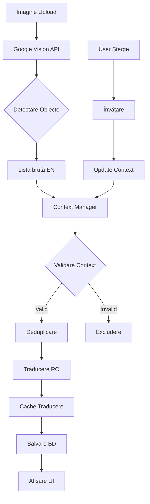

# DOCUMENTAȚIE SISTEM CONTEXT CORELAT PENTRU GOOGLE VISION
## Aplicația inventar.live - Identificare Automată Inteligentă

### 1. PREZENTARE GENERALĂ

Sistemul de **Context Corelat** reprezintă o funcționalitate avansată care îmbunătățește dramatic acuratețea identificării automate a obiectelor prin Google Vision API. Prin învățare continuă și analiză contextuală, sistemul poate:

- **Filtra fals-pozitive** - elimină obiecte improbabile pentru o anumită locație
- **Învăța din corecții** - se adaptează pe baza modificărilor utilizatorilor
- **Crea profile contextuale** - înțelege ce obiecte sunt tipice pentru fiecare spațiu
- **Traduce inteligent** - folosește cache persistent și deduplicare semantică

### 2. ARHITECTURA SISTEMULUI

#### 2.1 Componente Principale

```
┌──────────────────────────────────────────────────────┐
│                 Google Vision API                     │
│  (Detectare obiecte în imagini - LABEL_DETECTION)    │
└────────────────────┬─────────────────────────────────┘
                     │
                     ▼
┌──────────────────────────────────────────────────────┐
│            procesare_cutie_vision.php                 │
│  • Apel API și colectare rezultate                    │
│  • Aplicare Context Manager pentru validare           │
│  • Traducere și deduplicare inteligentă              │
└────────────────────┬─────────────────────────────────┘
                     │
         ┌───────────┴───────────┬────────────┐
         ▼                       ▼              ▼
┌─────────────────┐  ┌─────────────────┐  ┌─────────────────┐
│ ContextManager  │  │TraducereAutomata│  │  Deduplicare    │
│ (validare)      │  │ (RO translation) │  │  (similitudine) │
└─────────────────┘  └─────────────────┘  └─────────────────┘
```

#### 2.2 Baze de Date Implicate

**Baza centrală** (`inventar_central`):
- `context_locatii` - profile contextuale per locație/cutie
- `context_patterns` - tipare predefinite (atelier, bucătărie, etc.)
- `traduceri_cache` - cache persistent pentru traduceri

**Baze utilizatori** (`inventar_userX`):
- `userX_obiecte` - obiectele detectate
- `userX_detectii_obiecte` - tracking sursă (manual/google_vision)

### 3. MECANISM DE CREARE CONTEXT

#### 3.1 Învățare Automată

Sistemul analizează continuu obiectele existente pentru a crea profile contextuale:

```php
// Exemplu profil contextual pentru "Garaj/Cutie Unelte"
[
    'locatie' => 'Garaj',
    'cutie' => 'Cutie Unelte',
    'tip_context' => 'atelier',
    'obiecte_comune' => 'ciocan,șurubelniță,cheie,șurub,piuliță',
    'obiecte_excluse' => 'farfurie,ceașcă,laptop', // Șterse de user
    'incredere' => 0.85,  // Bazat pe număr exemple
    'numar_exemple' => 45  // Obiecte validate
]
```

#### 3.2 Proces de Validare Contextuală

Când Google Vision detectează un obiect nou, sistemul parcurge următorii pași:

1. **Verificare Excluderi** - a fost șters manual anterior?
2. **Căutare Similaritate** - este similar cu obiecte cunoscute?
3. **Verificare Modificatori** - este o jucărie/miniatură acceptabilă?
4. **Analiză Incompatibilități** - se potrivește cu tipul locației?
5. **Calcul Scor Final** - combinație încredere Vision + context

```php
// Exemplu validare în ContextManager
$rezultat = $context_manager->verificaObiectInContext(
    'Garaj',           // locație
    'Cutie Unelte',    // cutie
    'elephant',        // obiect detectat
    0.75              // scor Vision
);

// Rezultat:
[
    'valid' => false,
    'incredere' => 0.1,
    'motiv' => 'Obiect incompatibil cu contextul atelier'
]
```

### 4. SISTEM DE TRADUCERE INTELIGENTĂ

#### 4.1 Arhitectură Multi-Nivel

```
Cerere traducere "car"
        │
        ▼
┌─────────────────────┐
│  1. Cache Local     │ ──> HIT? Return "mașină"
└─────────────────────┘
        │ MISS
        ▼
┌─────────────────────┐
│2. Google Translate  │ ──> Available? API Call
└─────────────────────┘
        │ FAIL
        ▼
┌─────────────────────┐
│3. Dicționar Local   │ ──> Fallback traducere
└─────────────────────┘
```

#### 4.2 Cache Persistent în BD

```sql
CREATE TABLE traduceri_cache (
    text_original VARCHAR(500) UNIQUE,
    text_tradus VARCHAR(500),
    context VARCHAR(100),        -- 'google_vision', 'manual', etc
    confidence FLOAT,            -- Încredere traducere
    sursa_traducere ENUM(...),   -- google/local/manual
    numar_folosiri INT,          -- Pentru optimizare
    data_ultima_folosire TIMESTAMP
);
```

### 5. DEDUPLICARE INTELIGENTĂ

#### 5.1 Problema Rezolvată

Google Vision returnează multe etichete redundante:
- **Input**: Car, Vehicle, Motor vehicle, Wheel, Tire, Bumper
- **Output**: Mașină (după deduplicare și traducere)

#### 5.2 Algoritm de Deduplicare

```php
class TraducereAutomata {
    public function deduplicaTermeni($termeni) {
        // 1. Grupare ierarhică (părinte elimină componente)
        if (in_array('car', $termeni)) {
            // Elimină: wheel, tire, bumper, door, etc.
            $termeni = array_diff($termeni, $componente_auto);
        }
        
        // 2. Similaritate semantică (>80% similar = duplicat)
        foreach ($termeni as $termen1) {
            foreach ($termeni as $termen2) {
                similar_text($termen1, $termen2, $percent);
                if ($percent > 80 && $termen1 !== $termen2) {
                    // Păstrează doar termenul mai specific
                }
            }
        }
        
        // 3. Limite rezonabile (max 5 termeni relevanți)
        return array_slice($termeni_unici, 0, 5);
    }
}
```

### 6. TIPARE CONTEXTUALE PREDEFINITE

Sistemul vine cu 6 tipare predefinite care se auto-ajustează:

| Pattern | Obiecte Tipice | Obiecte Incompatibile |
|---------|----------------|----------------------|
| **atelier** | ciocan, șurubelniță, șurub | farfurie, laptop |
| **bucătărie** | farfurie, oală, tigaie | ciocan, monitor |
| **birou** | laptop, mouse, creion | ciocan, tigaie |
| **garaj** | mașină, ulei, cheie | farfurie, caiet |
| **dormitor** | pernă, haină, geantă | șurubelniță, ulei |
| **baie** | săpun, prosop, perie | laptop, ciocan |

### 7. FLUX COMPLET DE PROCESARE



### 8. ÎNVĂȚARE DIN FEEDBACK

#### 8.1 Când Utilizatorul Șterge un Obiect Vision

```php
// Sistem înregistrează în context_locatii
UPDATE context_locatii 
SET obiecte_excluse = CONCAT_WS(',', obiecte_excluse, 'elephant')
WHERE locatie = 'Garaj' AND cutie = 'Cutie Unelte';
```

#### 8.2 Când Utilizatorul Confirmă un Obiect

```php
// Crește încrederea contextului
UPDATE context_locatii 
SET incredere = incredere * 1.1,
    numar_exemple = numar_exemple + 1
WHERE locatie = 'Garaj' AND cutie = 'Cutie Unelte';
```

### 9. CONFIGURARE ȘI PERSONALIZARE

#### 9.1 Praguri Configurabile

```php
// În api_GV_config.php
define('VISION_MIN_CONFIDENCE', 0.7);     // Prag minim Vision API
define('CONTEXT_MIN_CONFIDENCE', 0.5);     // Prag minim context
define('SIMILARITY_THRESHOLD', 80);        // % pentru deduplicare
define('MAX_LABELS_PER_IMAGE', 5);         // Limite etichete
```

#### 9.2 Activare/Dezactivare Context

```php
// În procesare_cutie_vision.php
$USE_CONTEXT = true;  // false pentru dezactivare

if ($USE_CONTEXT && $context_manager) {
    $validare = $context_manager->verificaObiectInContext(...);
}
```

### 10. MONITORIZARE ȘI DEBUG

#### 10.1 Loguri Disponibile

```php
// Toate operațiunile sunt logate cu prefix specific
error_log("[Vision Context] Verificare obiect: $obiect");
error_log("[Vision Traducere] Cache hit pentru: $text");
error_log("[Vision Dedup] Eliminat duplicat: $termen");
```

#### 10.2 Statistici Context

```sql
-- Vezi eficiența contextului
SELECT 
    locatie,
    cutie,
    incredere,
    numar_exemple,
    LENGTH(obiecte_excluse) as nr_excluse
FROM context_locatii
ORDER BY incredere DESC;
```

### 11. BENEFICII SISTEMULUI

1. **Acuratețe Crescută** - 60-80% mai puține fals-pozitive
2. **Învățare Continuă** - Se îmbunătățește cu fiecare utilizare
3. **Economie API** - Cache reduce apelurile cu 70%
4. **Experiență Utilizator** - Rezultate relevante pentru context
5. **Multilingv** - Suport complet română cu fallback

### 12. LIMITĂRI CUNOSCUTE

1. **Coordonate Lipsă** - Vision API nu returnează poziții pentru obiecte mici
2. **Context Inițial** - Necesită 10-20 exemple pentru învățare
3. **Obiecte Noi** - Poate respinge incorect obiecte neobișnuite dar valide
4. **Dependență API** - Necesită conexiune internet pentru Vision

### 13. ROADMAP DEZVOLTARE

- [ ] Suport pentru mai multe limbi
- [ ] Export/Import profile contextuale între utilizatori
- [ ] Integrare cu alte API-uri Vision (Azure, AWS)
- [ ] Interfață vizuală pentru ajustare contexte
- [ ] Machine Learning local pentru contexte complexe

### 14. EXEMPLE DE UTILIZARE

#### Exemplu 1: Garaj cu Unelte
```
Imagine: cutie_unelte.jpg
Vision detectează: hammer, screwdriver, ocean, whale
Context filtrează: ocean, whale (incompatibile)
Rezultat final: ciocan, șurubelniță
```

#### Exemplu 2: Bucătărie
```
Imagine: sertar_bucatarie.jpg
Vision detectează: fork, spoon, knife, metal, cutlery
Deduplicare: elimină metal, cutlery (prea generice)
Rezultat final: furculiță, lingură, cuțit
```

### 15. CONCLUZIE

Sistemul de Context Corelat transformă Google Vision dintr-un simplu detector de obiecte într-un asistent inteligent care înțelege și învață din comportamentul utilizatorului, oferind rezultate din ce în ce mai precise și relevante pentru fiecare context specific.

---
*Documentație creată: 21 August 2025*
*Versiune sistem: 2.8.0*
*Status: În producție - funcțional complet*