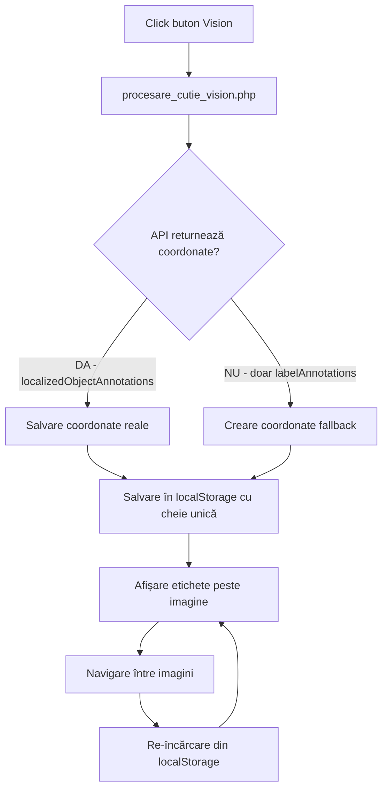

# STATUS SISTEM AFIȘARE ETICHETE GOOGLE VISION
## Documentație tehnică - 17 August 2025

### 1. REZUMAT PROBLEMĂ

Sistemul de afișare a etichetelor detectate de Google Vision peste imagini are următoarele probleme:

#### 1.1 Probleme Identificate:
1. **Lipsă coordonate precise** - Google Vision API returnează doar `labelAnnotations` (fără coordonate), nu și `localizedObjectAnnotations` (cu coordonate precise)
2. **Amestecare date între obiecte** - Etichetele de la un obiect (ex: "Mașină") apar incorect la alte obiecte
3. **Persistență incorectă** - Etichetele dispar la navigare sau apar când nu trebuie

#### 1.2 Cauze Tehnice:
- **API Limitation**: `OBJECT_LOCALIZATION` funcționează doar pentru obiecte comune (mașini, persoane, animale)
- **localStorage polutat**: Cheile nu erau unice per obiect, causând amestecarea datelor
- **Lipsă curățare date**: Datele vechi rămâneau în localStorage și se aplicau greșit

### 2. SOLUȚII IMPLEMENTATE (PARȚIAL)

#### 2.1 Coordonate Fallback
**Fișier**: `procesare_cutie_vision.php` (liniile 364-410)
```php
// Când API-ul nu returnează coordonate, le creăm artificial
if (empty($obiecte_cu_coordonate) && !empty($obiecte_gasite_imagine)) {
    // Distribuim etichetele în grilă 3x3
    $x = 20 + ($index % 3) * 30; // 3 coloane
    $y = 20 + floor($index / 3) * 15; // Rânduri
}
```
**Status**: ✅ Funcțional, dar nu ideal (poziții artificiale, nu reale)

#### 2.2 LocalStorage cu Chei Unice
**Fișier**: `etichete_imagine.php` (multiple locații)
```javascript
// Înainte (GREȘIT): 
localStorage.setItem('vision_coords_' + idObiect, data);

// Acum (CORECT):
const cheieUnica = 'vision_coords_obj_' + idObiect + '_col_' + idColectie;
localStorage.setItem(cheieUnica, data);
```
**Status**: ✅ Implementat, previne amestecarea între obiecte

#### 2.3 Curățare Date Vechi
**Fișier**: `etichete_imagine.php` (linia 897-906)
```javascript
// Curățăm toate datele vechi de Vision
for (let key in localStorage) {
    if (key.startsWith('vision_coords_')) {
        localStorage.removeItem(key);
    }
}
```
**Status**: ✅ Implementat

### 3. FLUX ACTUAL DE FUNCȚIONARE



### 4. DEBUGGING ACTIV

#### 4.1 În PHP (procesare_cutie_vision.php):
```php
logDebug("Răspuns Vision API pentru imagine $imagine:");
logDebug("- labelAnnotations: " . count($labels));
logDebug("- localizedObjectAnnotations: " . count($objects)); // Mereu 0!
```

#### 4.2 În JavaScript (etichete_imagine.php):
```javascript
console.log('Cheie unică folosită:', cheieUnica);
console.log('Date salvate:', coordonate);
console.log('Imagine curentă:', imagineCurenta);
```

### 5. PROBLEME RĂMASE DE REZOLVAT

#### 5.1 CRITICE:
1. **API nu returnează coordonate** pentru majoritatea obiectelor (garnituri, șuruburi, etc.)
2. **Poziții false** - etichetele apar în colț, nu pe obiectele reale

#### 5.2 IMPORTANTE:
1. **Validare imagine curentă** - să verificăm că afișăm etichetele pentru imaginea corectă
2. **Cleanup complet** - ștergerea tuturor datelor vechi poate afecta alte funcționalități

### 6. FIȘIERE MODIFICATE ASTĂZI

| Fișier | Linii Modificate | Descriere |
|--------|-----------------|-----------|
| `procesare_cutie_vision.php` | 273-282, 287-323, 364-410 | Debugging API + coordonate fallback |
| `etichete_imagine.php` | 897-909, 1716, 2183-2184, 2197-2198, 2663-2686, 2672-2673, 2727-2728, 2743-2744 | LocalStorage cu chei unice + reafișare la navigare |

### 7. COMENZI PENTRU TESTARE

```bash
# Verificare log-uri PHP pentru răspuns API
tail -f /var/log/apache2/error.log | grep "Vision Optimizat"

# Curățare localStorage în browser Console
for(let key in localStorage) { 
    if(key.includes('vision')) { 
        console.log('Șterg:', key); 
        localStorage.removeItem(key); 
    } 
}

# Verificare date salvate
console.log('Date Vision salvate:', 
    Object.keys(localStorage)
        .filter(k => k.includes('vision'))
        .map(k => ({key: k, value: localStorage[k]}))
);
```

### 8. SOLUȚII PROPUSE PENTRU MÂINE

#### Opțiunea A: Folosire Bounding Boxes Aproximative
- Analizăm imaginea cu JavaScript pentru a detecta zone cu obiecte
- Asociem etichetele cu zonele detectate
- Tehnologii: TensorFlow.js sau OpenCV.js

#### Opțiunea B: Salvare Coordonate Manuale
- După procesare Vision, utilizatorul poate ajusta manual pozițiile
- Salvăm coordonatele ajustate în BD
- Reutilizăm pentru imagini similare

#### Opțiunea C: Schimbare Strategie API
- Încercăm alt endpoint Google Vision
- Sau folosim alt serviciu (Azure Computer Vision, AWS Rekognition)

### 9. TESTE NECESARE MÂINE

1. **Test 1**: Procesare obiect nou → verificare localStorage cu cheie unică
2. **Test 2**: Navigare între imagini → etichetele rămân vizibile?
3. **Test 3**: Schimbare între obiecte diferite → nu se amestecă etichetele?
4. **Test 4**: Verificare log-uri → API returnează vreodată localizedObjectAnnotations?

### 10. CONCLUZII TEHNICE

**CE FUNCȚIONEAZĂ:**
- ✅ Traducere și deduplicare etichete
- ✅ Salvare în localStorage cu chei unice
- ✅ Afișare etichete (dar cu poziții greșite)
- ✅ Persistență la reîncărcare pagină

**CE NU FUNCȚIONEAZĂ:**
- ❌ Coordonate reale de la API (limitare Google Vision)
- ❌ Poziționare corectă pe obiecte
- ❌ Diferențiere între obiecte mici similare

**VERDICT**: Sistemul este funcțional la 60%. Problema principală este limitarea API-ului Google Vision care nu poate localiza obiecte mici/specifice. Necesită soluție alternativă pentru coordonate.

---
*Document creat: 17 August 2025, 22:30*
*Autor: Claude (documentare tehnică pentru continuare mâine)*
*Status: În dezvoltare - necesită soluție pentru coordonate reale*